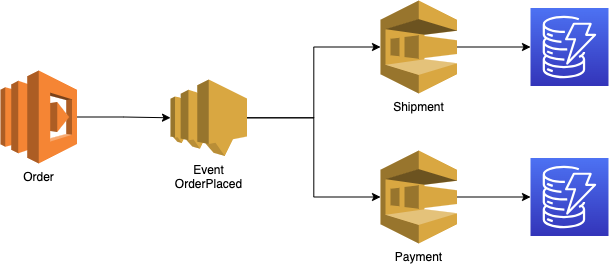

# Labs for Lambda

Here you will find the labs for Lambda

## Zip Python and upload
1.
- Write a Lambda function with Python code (Locally in instruqt, not the AWS console)
  - Don’t forget to use the lambda_handler()
  - Do something simple with Numpy
- Zip the Python code and dependencies
- Upload the zip to Lambda through the CLI

2.
- Create a bash script or make file to automate this process
  - pip install (Make sure you install in a specific directory (venv))
  - zip the dependencies and code
  - update the Lambda function with the zip

## Event-driven architecture

### Create DynamoDB, SQS and SNS

1.
- Create 2 DynamoDB tables (console)
    - Names: orders, invoices
    - Partition key: orderid
    - Customize settings
      - Read/write capacity settings: On-demand

2.
- Create 2 SQS queues
  - Names: shipment, payment
  - Standard queues

3.
- Create an SNS topic
  - Name: order
  - Must be STANDARD topic

### Create Lambda

1.
- Create 3 Lambda functions
  - Names: order, payment, shipment
  - Author from scratch
  - Python 3.11

2.
- Copy the code from the gist to the Lambda function

### Setup subscription

1.
- On the SNS topic setup a subscription for both SQS queues
  - Make sure the IAM policies are setup correctly!! You have to change these on the SQS queues

### Setup a SQS trigger for Lambda

1.
- Go to the SQS queue and set up a Lambda trigger
  - Make sure the IAM policies are setup correctly!!
  -You have to changes these in the Lambda execution role

### Test it

1.
- Test/execute the first Lambda called order
  - Debug where needed
    - Do you see something in the CloudWatch logs of the Lambda?
    - Read the error messages carefully!!
- Result should be an entry in both DynamoDB tables
